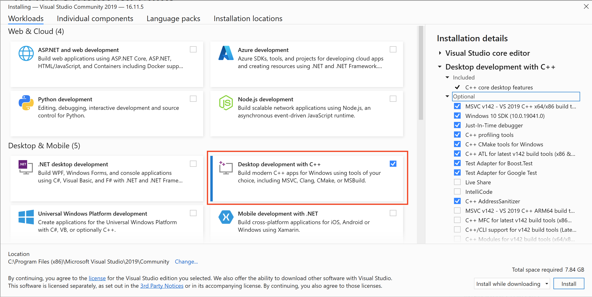

# 入门指南

本主题说明如何获取QGroundControl源代码并在本机或在Vagrant(虚拟机)环境中构建它。 本主题还提供其他可选功能信息及特定于操作系统的功能信息。

## 每日构建

如果您只是想测试 (而不是调试) 最近生成的 *QGroundControl* ，那么请使用[Daily build](https://docs.qgroundcontrol.com/en/releases/daily_builds.html)。 官方提供了适用于所有平台的版本。

## 源代码 

*QGroundControl* 的源代码保存在 github 上，下载地址为: https://github.com/mavlink/qgroundcontrol。 QGroundControl源代码在Apache 2.0和GPLv3下是双许可的。 有关更多信息，请参阅：许可证。

要获取源文件, 请执行以下操作:

1. 克隆存储库 (或您的分叉), 包括子模块: ```git clone --recursive -j8 https://github.com/mavlink/qgroundcontrol.git```
2. 2.更新子模块（每次拉新源代码时都这样做）： ```git submodule update --recursive```

> 提示：不能使用Github以zip形式下载源文件，因为zip压缩包中不包含相应的子模块源代码。 你必须使用git工具！

## 构建QGroundControl开发环境

### Using Containers

We support Linux builds using a container found on the source tree of the repository, which can help you develop and deploy the QGC apps without having to install any of the requirements on your local environment.

[Container Guide](../getting_started/container.md)

### Native Builds

*QGroundControl* builds are supported for macOS, Linux, Windows, iOS and Android. *QGroundControl* uses [Qt](http://www.qt.io) as its cross-platform support library and uses [QtCreator](http://doc.qt.io/qtcreator/index.html) as its default build environment.

- macOS：v10.11或更高版本
- Ubuntu：64位，gcc编译器
- **Windows:** Vista or higher, [Visual Studio 2019 compiler](#vs) (64 bit)
- iOS：10.0及更高版本
- Android：Jelly Bean（4.1）及更高版本。 标准QGC是针对ndk 19版本构建的。
- **Qt version:** {{ book.qt_version }} **(only)** <!-- NOTE {{ book.qt_version }} is set in the variables section of gitbook file https://github.com/mavlink/qgc-dev-guide/blob/master/book.json --> > 
    
    **Warning** **Do not use any other version of Qt!** QGC has been thoroughly tested with the specified version of Qt ({{ book.qt_version }}). There is a significant risk that other Qt versions will inject bugs that affect stability and safety (even if QGC compiles).

For more information see: [Qt 5 supported platform list](http://doc.qt.io/qt-5/supported-platforms.html).

<span></span>

> **Note** Native [CentOS Builds](../getting_started/CentOS.md) are also supported, but are documented separately (as the tested environment is different).

#### Install Visual Studio 2019 (Windows Only) {#vs}

The Windows compiler can be found here: [Visual Studio 2019 compiler](https://visualstudio.microsoft.com/vs/older-downloads/) (64 bit)

When installing, select *Desktop development with C++* as shown:



> **Note** Visual Studio is ONLY used to get the compiler. Actually building *QGroundControl* should be done using [Qt Creator](#qt-creator) or [qmake](#qmake) as outlined below.

#### 安装Qt

You **need to install Qt as described below** instead of using pre-built packages from say, a Linux distribution, because *QGroundControl* needs access to private Qt headers.

To install Qt:

1. 下载并运行[Qt Online Installer](http://www.qt.io/download-open-source) 
    - **Ubuntu:** 
        - 使用以下命令将下载的文件设置为可执行文件：`chmod + x`
        - 请安装到默认位置, 以便与 **./qgroundcontrol-start.sh** 一起使用。如果将 Qt 安装到非默认位置, 则需要修改 **qgroundcontrol-start.sh** ，才能运行下载的组件。

2. 在安装程序 的*Select 组件 </0 > 对话框中, 选择 {{ book.qt_version }}。</p> 
    
    > **Note** If the version needed is not displayed, check the archive (show archive and refresh).
    
    然后，按如下向导，安装组件:</li> </ol> 
    
    - **Windows**: *MSVC 2019 64 bit*
    - **MacOS**: *macOS*
    - **Linux**: *Desktop gcc 64-bit*
    - All:
        
        - *Qt Charts* <!-- and *Qt Remote Objects (TP)* -->
        
        - *Android ARMv7* (optional, used to build Android)
        
        
    
    1. Install Additional Packages (Platform Specific) 
        - **Ubuntu:** `sudo apt-get install speech-dispatcher libudev-dev libsdl2-dev`
        - **Fedora:** `sudo dnf install speech-dispatcher SDL2-devel SDL2 systemd-devel`
        - **Arch Linux:** `pacman -Sy speech-dispatcher`
        - **Android:** [Qt Android Setup](http://doc.qt.io/qt-5/androidgs.html)
    
    2. Install Optional/OS-Specific Functionality
        
        > **Note** Optional features that are dependent on the operating system and user-installed libraries are linked/described below. These features can be forcibly enabled/disabled by specifying additional values to qmake.
    
    - **Video Streaming/Gstreamer:** - see [Video Streaming](https://github.com/mavlink/qgroundcontrol/blob/master/src/VideoReceiver/README.md).
    
    #### Building using Qt Creator {#qt-creator}
    
    1. Launch *Qt Creator* and open the **qgroundcontrol.pro** project.
    2. Select the appropriate kit for your needs: 
        - **OSX:** Desktop Qt {{ book.qt_version }} clang 64 bit > **Note** iOS builds must be built using [XCode](http://doc.qt.io/qt-5/ios-support.html).
        - **Ubuntu:** Desktop Qt {{ book.qt_version }} GCC 64bit
        - **Windows:** Desktop Qt {{ book.qt_version }} MSVC2019 **64bit**
        - **Android:** Android for armeabi-v7a (GCC 4.9, Qt {{ book.qt_version }})
    
    3. Build using the "hammer" (or "play") icons:
        
        
    
    #### Build using qmake on CLI {#qmake}
    
    Example commands to build a default QGC and run it afterwards:
    
    1. Make sure you cloned the repository and updated the submodules before, see chapter *Source Code* above and switch into the repository folder: ```cd qgroundcontrol```
    2. Create and enter a shadow build directory: 
            mkdir build
            cd build
    
    3. Configure the build using the qmake script in the root of the repository: ```qmake ../```
    4. Run make to compile and link. To accelerate the process things you can use the -j{number of threds} parameter. ```make -j12```
    5. Run the QGroundcontrol binary that was just built: ```./staging/QGroundControl```
    
    ### Vagrant
    
    [Vagrant](https://www.vagrantup.com/) can be used to build and run *QGroundControl* within a Linux virtual machine (the build can also be run on the host machine if it is compatible).
    
    1. [Download](https://www.vagrantup.com/downloads.html) and [Install](https://www.vagrantup.com/docs/getting-started/) Vagrant
    2. From the root directory of the *QGroundControl* repository run `vagrant up`
    3. To use the graphical environment run `vagrant reload`
    
    ### Additional Build Notes for all Supported OS
    
    - **Parallel builds:** For non Windows builds, you can use the `-j#` option to run parellel builds.
    - **Location of built files:** Individual build file results can be found in the `build_debug` or `build_release` directories. The built executable can be found in the `debug` or `release` directory.
    - **If you get this error when running *QGroundControl***: `/usr/lib/x86_64-linux-gnu/libstdc++.so.6: version 'GLIBCXX_3.4.20' not found.`, you need to either update to the latest *gcc*, or install the latest *libstdc++.6* using: `sudo apt-get install libstdc++6`.
    - **Unit tests:** To run the [unit tests](../contribute/unit_tests.md), build in `debug` mode with `UNITTEST_BUILD` definition, and then copy `deploy/qgroundcontrol-start.sh` script into the `debug` directory before running the tests.
    
    ## Building QGC Installation Files
    
    You can additionally create installation file(s) for *QGroundControl* as part of the normal build process.
    
    > **Note** On Windows you will need to first install [NSIS](https://sourceforge.net/projects/nsis/).
    
    To add support for installation file creation you need to add `CONFIG+=installer` to your project file, or when you call *qmake*.
    
    To do this in *Qt Creator*:
    
    - Open **Projects > Build > Build Steps > qmake > Additional arguments**.
    - Enter `CONFIG+=installer` as shown: 